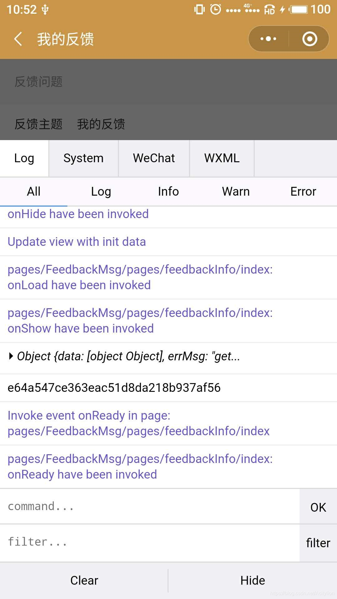
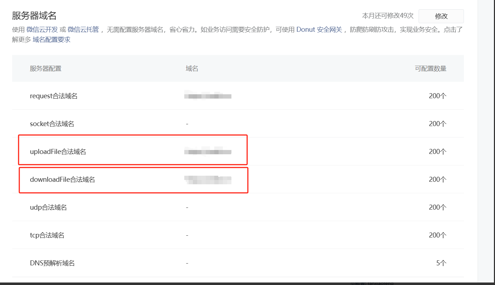

# 踩坑系列
## 微信小程序图片上传、下载失败
小程序测试版和体验版测试图片上传没有问题，到了正式版的时候点击上传按钮立刻报错，感觉没有走接口，在调用日志的时候也看不到任何其他错误。
查找资料，总结以下原因：

1. 打开体验版的调试工具，查看日志以及报错信息（这里没有看到任何错误）
 
2. 先看服务器域名是否配置，updateFile，downloadFile

我的问题是红色的域名没有配置，配置上就ok了。
注意：下载用的是腾讯的cos，这里要填cos的域名。

