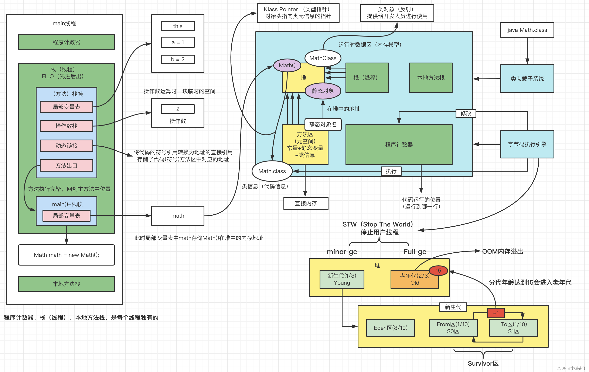

# JVM
## 一、JVM模型图

JVM内存模型包括：
线程私有：
程序计数器、虚拟机栈（线程）

所有线程共享：
本地方法栈、Java堆、方法区（元空间）

1. 程序计数器：
   - 线程私有
   - 用于存储当前线程执行的字节码指令的地址
   - 在多线程环境下，不同线程的程序计数器互不影响
2. Java虚拟机栈：
   - 线程私有
   - 每个线程创建的时候都有一个私有的栈
   - 包含多个栈帧，每个方法调用都会创建一个栈帧
   - 栈帧随着方法的调用和返回而入栈和出栈
3. 本地方法栈
   - 用于支持native方法的执行。
   - native方法是使用非Java语言编写的，通过JNI与Java程序进行交互。
4. Java堆（Java Heap）
   - 用于存储对象实例和数组（数组本质也是对象）。
   - 所有线程共享的内存区域，是垃圾回收的主要区域。
   - 可分为新生代，老年代，永久代（或称为方法区）。
5. 方法区
   - 存储类的结构信息、常量、静态变量等数据。
   - 在JVM规范中，将方法区划分为非堆区域。
   - JDK8及之后版本，用元空间取代了永久代。
6. 运行时常量池
   - 保存编译期生成的各种字面量和符号引用。
   - 方法区的一部分。
## 二、垃圾收集算法
1. 标记-清除算法
   - 标记阶段：从根节点出发，标记所有可达的对象。
   - 清除阶段：清除所有未被标记的对象，释放其占用的内存空间。
   - 缺点：可能会导致内存碎片化，清理阶段会导致停顿
2. 复制算法
   - 将内存分为两个区域，每次只使用其中一个区域。
   - 当一个区域满时，将存活的对象复制到另一个区域，然后清除原来的区域。
   - 缺点：每次只能利用一半空间，另一半浪费着。
3. 标记-整理算法
   - 标记整理算法的标记过程和标记-清除算法的标记过程一致，但是标记之后不会直接清理。而是将所有存活对象都移动到内存的一端。移动结束后直接清理掉剩余的部分。
4. 分代手机算法
   - 分代收集是将内存划分成了新生代和老年代。新生代又分为：较大的Eden区（占80%）和两块Survivor区（各占10%），刚刚创建的对象存放在新生代的Eden区。
   - 当Eden区没有足够的空间的时候虚拟机会发起一次Minor GC，Minor GC之后，存活的对象会进入其中的一块Suvivor区，Eden区被清空，如果Suvivor区内存不够则直接进入老年代。
   下一次Minor GC会将Eden和该Suvivor区的存活对象复制到另一块Suvivor区，并将Eden区和该Suvivor区清空。
   - 分配的依据是对象的生存周期，或者说经历过的GC次数。对象创建时，一般在新生代申请内存，当经历一次GC一直如果对象还存活，那么对象的年龄+1，当年龄超过一定值（默认15，可以通过参数 -XX:MaxTenuringThreshold来设定）后，如果对象还存活，那么该对象会进入老年代。
   - 当老年代被占满会发生Major GC，Major GC执行的速度比Minor GC慢十倍以上
#### 为什么需要Survivor区？
当有了Survivor区，存活的对象在两个Survivor区中倒腾。
## 四种引用类型
### 强引用
在 Java 中最常见的就是强引用，把一个对象赋给一个引用变量，这个引用变量就是一个强引用。
当一个对象被强引用变量引用时，它处于可达状态，他是不可能被垃圾回收机制回收的，即使该对象以后永远都不会被用到 JVM 也不会回收。
因此强引用时造成 Java 内存泄漏的主要原因之一。
```java
Object obj = new Object(); // 强引用
```
### 软引用
   软引用需要用 SoftReference 类来实现，对于只有软引用的对象来说，当系统内存足够时它不会被回收，`当系统内存空间不足时它会被回收`。软引用通常用在对内存敏感的程序中。
```java
SoftReference<Object> softRef = new SoftReference<>(new Object());
```
### 弱引用
   弱引用需要用 WeakReference 类来实现，它比软引用的生存期更短，对于只有弱引用的对象来说，只要垃圾回收机制一运行，不管 JVM 的空间是否足够，总会回收该对象的占用的内存。
```java
WeakReference<Object> weakRef = new WeakReference<>(new Object());
```
### 虚引用
虚引用需要 PhantomReference 类来实现，它不能单独使用，必须和引入队列联合使用。虚引用的主要作用是跟踪对象被垃圾回收的状态。
```java
PhantomReference<Object> phantomRef = new PhantomReference<>(new Object(), referenceQueue);
```
##虚拟机类加载机制
## 简述java类加载机制
## 描述一下JVM加载Class文件的原理机制
## 什么是类加载，类加载器有哪些


