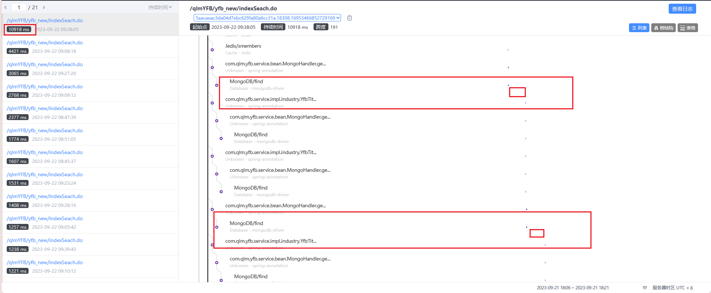

# 搜索接口搜索“苏州协同创新智能科技时”超时调优

## 背景

测试说搜索接口查询搜索 “苏州协同创新智能科技时”，报红超时，去kibana捞日志

```bash
请求出现异常,10940,异常信息：
org.apache.catalina.connector.ClientAbortException: java.io.IOException: Broken pipe
	at org.apache.catalina.connector.OutputBuffer.realWriteBytes(OutputBuffer.java:356)
	at org.apache.catalina.connector.OutputBuffer.flushByteBuffer(OutputBuffer.java:825)
	at org.apache.catalina.connector.OutputBuffer.append(OutputBuffer.java:730)
	at org.apache.catalina.connector.OutputBuffer.writeBytes(OutputBuffer.java:391)
	at org.apache.catalina.connector.OutputBuffer.write(OutputBuffer.java:369)
	at org.apache.catalina.connector.CoyoteOutputStream.write(CoyoteOutputStream.java:96)
	at sun.nio.cs.StreamEncoder.writeBytes(StreamEncoder.java:221)
	at sun.nio.cs.StreamEncoder.implWrite(StreamEncoder.java:282)
	at sun.nio.cs.StreamEncoder.write(StreamEncoder.java:125)
	at sun.nio.cs.StreamEncoder.write(StreamEncoder.java:135)
	at java.io.OutputStreamWriter.write(OutputStreamWriter.java:220)
	at java.io.Writer.write(Writer.java:157)
	at org.springframework.util.StreamUtils.copy(StreamUtils.java:118)
	at 
```

这里可以看到org.apache.catalina.connector.ClientAbortException: java.io.IOException: Broken pipe断开了连接，

## 认识broken pipe

*pipe是管道的意思，管道里面是数据流，通常是从文件或网络套接字读取的数据。 当该管道从另一端突然关闭时，会发生数据突然中断，即是broken。 对于文件File来说，这可能是文件安装在已断开连接的光盘或远程网络上。 对于socket来说，可能是网络被拔出或另一端的进程崩溃。 在Java中，没有具体的BrokenPipeException。 将此类错误包含在另一个异常，例如java.io.IOException:Broken pipe*

## 可能原因

1、客户端请求服务器数据，服务器突然挂了；

2、客户端请求服务端数据，服务端正常返回，凡是客户端由于超时等原因断开。

这里服务器是没有挂的，我们是第二种，也就是浏览器等不到后端处理的结果了，断开了。

## Skywalking分析



1.搜索发现这个这里消耗了大量时间，因为这个搜索词搜出来的内容太多了，去代码定位如下图


## 优化步骤
1.这个方法往下是查询两次mongo，点进第一个查询这里优化了一下，原来split拆分成数组，然后通过asList将数组转换成列表，又创建了一个新的arrayList
2.接着就是外层循环改成多线程，一开始用的并行流，效果不大，并行流的核心数是cup数，用多线程自定义线程数为cup*3试了下效果快了3-4倍，接口时间从原来的21秒优化到现在的5-6秒


```
CATALINA_OPTS="$CATALINA_OPTS -javaagent:/usr/local/skywalking/apache-skywalking-apm-bin/agent/skywalking-agent.jar"; export CATALINA_OPTS
```


JAVA_OPTS="  -javaagent:/usr/local/agent/skywalking-agent.jar  -Dskywalking.agent.service_name=yfb-9101  -server -Djava.security.egd=file:/dev/./urandom  -Xmx1500m -Xms512m -Xss256k  -XX:MetaspaceSize=64m -XX:MaxMetaspaceSize=512m -XX:+UseConcMarkSweepGC -XX:+UseParNewGC  -XX:+CMSClassUnloadingEnabled -Djava.awt.headless=true -Dfile.encoding=UTF-8 -Dsun.jnu.encoding=UTF-8 "


-javaagent:/usr/local/agent/skywalking-agent.jar  -Dskywalking.agent.service_name=yfb-9102  -server


