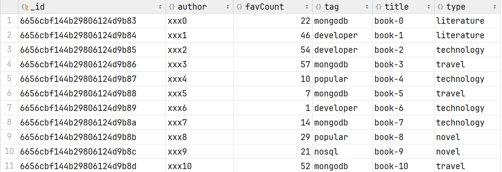

#JavaScript 代码
```javascript
var tags = ["nosql", "mongodb", "document", "developer", "popular"];
var types = ["technology", "sociality", "travel", "novel", "literature"];
var books = [];
for (var i = 0; i < 50; i++) {
var typeIdx = Math.floor(Math.random() * types.length);
var tagIdx = Math.floor(Math.random() * tags.length);
var favCount = Math.floor(Math.random() * 100);
var book = {
title: "book-" + i,
type: types[typeIdx],
tag: tags[tagIdx],
favCount: favCount,
author: "xxx" + i
};
books.push(book);
}
db.books.insertMany(books);
```
示例二
```javascript
var tags = ["nosql", "mongodb", "document", "developer", "popular"];
var types = ["technology", "sociality", "travel", "novel", "literature"];
var books = [];
for (var i = 0; i < 50; i++) {
    var typeIdx = Math.floor(Math.random() * types.length);
    var tagIdx = Math.floor(Math.random() * tags.length);
    var tagIdx2 = Math.floor(Math.random() * tags.length);
    var favCount = Math.floor(Math.random() * 100);
    var username = "xx00" + Math.floor(Math.random() * 10);
    var age = 20 + Math.floor(Math.random() * 15);
    var book = {
        title: "book-" + i,
        type: types[typeIdx],
        tag: [tags[tagIdx], tags[tagIdx2]],
        favCount: favCount,
        author: {name: username, age: age}
    };
    books.push(book)
}
db.books.insertMany(books);
```
## 效果：


